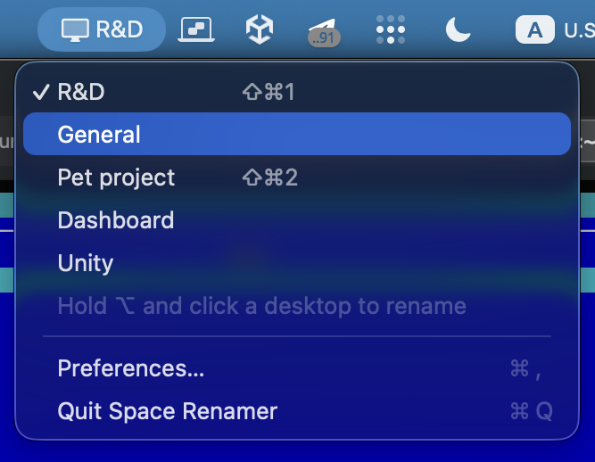
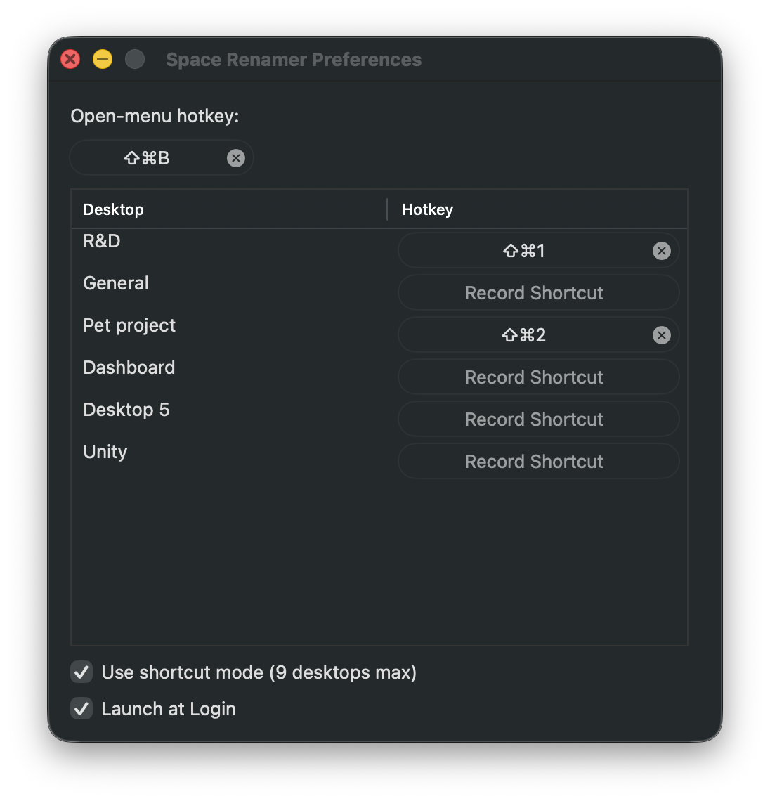

# Space Renamer

[](https://github.com/noobomancer/space-renamer/actions/workflows/ci.yml)

A macOS menu-bar app to give Mission Control desktops custom names and switch to any of them by click or global hotkey.





## Features

- **Custom names per desktop**, persisted across reorders (keyed by `ManagedSpaceID`).
- **Active desktop name in the menu bar** with a 🖥 SF Symbol.
- **Click a desktop in the menu to switch** — uncapped, works for any number of desktops.
- **Per-desktop global hotkeys** set in Preferences; each desktop's assigned shortcut is shown as a read-only hint to the right of its name in the menu.
- **Two switch modes** (Preferences ▸ *Use shortcut mode*):
  - **Move a space** *(default, uncapped)* — relative `Ctrl+←`/`Ctrl+→` (the system "Move left/right a space" hotkeys), animated transition, any number of desktops.
  - **Shortcut mode (9 desktops max)** — `Ctrl+1`…`Ctrl+9` (the system "Switch to Desktop N" hotkeys), one instant keystroke per switch but only for desktops 1–9.
- **⌥-click a desktop** in the menu to rename it.
- **Launch at Login** toggle in Preferences.
- Graceful UX when system prerequisites are missing (the menu greys unreachable rows in shortcut mode; the launch warning names the active mode's required shortcuts).

## Requirements

- macOS 13 or later, Apple Silicon or Intel.
- For building: **Xcode 15+** and [`xcodegen`](https://github.com/yonaskolb/XcodeGen) (`brew install xcodegen`).

## Distribution

Source-only. Build it locally — see below. No notarized binary is published; that would require an Apple Developer Program account. Patches to add a notarized release path are welcome.

## Build

The build requires a **stable self-signed code-signing identity** in your login keychain. This is a strict requirement, not optional polish: ad-hoc signing (`CODE_SIGN_IDENTITY="-"`) produces no stable Designated Requirement, so macOS TCC won't honor the Accessibility grant the app needs to synthesize the system switch hotkeys — switching will silently fail. The included script creates the identity once:

```sh
./scripts/create-signing-cert.sh
xcodegen generate
DEVELOPER_DIR=/Applications/Xcode.app/Contents/Developer \
  xcodebuild -project SpaceRenamer.xcodeproj -scheme SpaceRenamer \
             -configuration Release -destination 'platform=macOS' build
```

The built `.app` lives in your DerivedData (`~/Library/Developer/Xcode/DerivedData/SpaceRenamer-*/Build/Products/Release/SpaceRenamer.app`).

**Always launch the app via `open` or by double-clicking it** — exec'ing the binary directly from a terminal poisons TCC attribution (the responsible process becomes the terminal), and Accessibility checks return `false` confusingly.

## First run

1. macOS will prompt for **Accessibility** permission. Grant it under *System Settings → Privacy & Security → Accessibility*. The app uses Accessibility only to post the same Mission Control hotkey events that a real keypress would generate — there is no other system access.
2. Make sure the active mode's Mission Control shortcuts are enabled in *System Settings → Keyboard → Keyboard Shortcuts → Mission Control*:
   - **Move a space mode** (default): *Move left a space* and *Move right a space* (usually enabled by default).
   - **Shortcut mode**: the *Switch to Desktop N* shortcuts you want to use (typically off by default; enable as needed).

The app shows a one-shot launch alert if the active mode's prerequisite is missing.

## Tests

Pure logic lives in the `SpaceRenamerCore` SwiftPM library and is fully unit-tested:

```sh
DEVELOPER_DIR=/Applications/Xcode.app/Contents/Developer swift test
# Executed 60 tests, with 0 failures
```

The `DEVELOPER_DIR` prefix is required: the Command Line Tools' bundled Swift toolchain lacks XCTest, so plain `swift test` fails.

The keystroke effect itself isn't unit-testable (it depends on macOS), but the delta/direction/count logic of both switchers, the symbolic-hotkey checker, the name store, the plist parser, and the active-space reader's parsing all are.

## How it works (high level)

- **Active-Space detection** uses the read-only private SkyLight SPI `CGSCopyManagedDisplaySpaces`, resolved at runtime via `dlsym` (no link-time dependency on a private framework). `com.apple.spaces.plist`'s *Current Space* isn't kept live by macOS, so this is required to track the active desktop in real time.
- **Switching** synthesizes the **public** Mission Control keyboard shortcuts via `CGEvent` posted to `.cghidEventTap`. This goes through the same WindowServer hotkey handler as a real keypress, producing the real animated space switch — without any private *write* APIs, scripting addition, or SIP changes.
- **Names** are persisted in standard `UserDefaults` keyed by `ManagedSpaceID`. **Per-desktop hotkeys** use the [KeyboardShortcuts](https://github.com/sindresorhus/KeyboardShortcuts) library, also keyed by `ManagedSpaceID`.

The full design — including rejected approaches (notably the SkyLight *write* SPI, with real-machine evidence that it only updates bookkeeping without performing the visible switch) — is recorded in [`docs/superpowers/specs/2026-05-15-space-renamer-design.md`](docs/superpowers/specs/2026-05-15-space-renamer-design.md).

## Known limitations

- **`ManagedSpaceID` drift across logout/restart**: macOS occasionally renumbers the IDs even when the desktop layout is unchanged. Both names and per-desktop hotkeys are keyed by these IDs, so they can become orphaned in that case. An automatic old→new remap is planned but not yet implemented. Workaround: reassign in Preferences once after a drift.
- **Multi-display**: only the primary display's Spaces are managed at present.
- **Shortcut mode** is hard-capped at 9 desktops — macOS only defines *Switch to Desktop 1–9*. Use the default arrow mode for >9.
- **Multi-hop arrow switches** post one keystroke per ordinal step with a short pacing delay, so a far jump (e.g. desktop 1 → 11) takes ~1 second.

## Bundle identifier

The bundle ID is `com.saint.SpaceRenamer`. Forks should change this in `project.yml` (and re-create the signing cert and re-grant Accessibility, since macOS TCC keys grants by bundle ID).

## Contributing

See [`CONTRIBUTING.md`](CONTRIBUTING.md).

## Development methodology

This project was built with AI-assisted development (Claude Code). Commits authored with that assistance carry a `Co-Authored-By: Claude` trailer. The design spec under `docs/superpowers/specs/` records decisions and revisions chronologically (D1–D9 plus several dated revisions), including rejected approaches with the evidence that ruled them out — kept in the public repo as engineering history.

## License

MIT — see [`LICENSE`](LICENSE).
